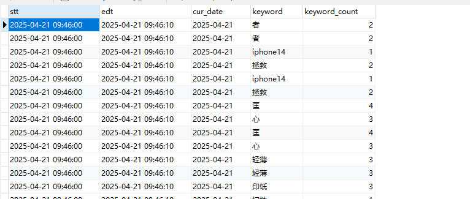

> flink dim 效果运行截图如下
> ,,,
> flink dwd_base_db 效果运行截图如下
> ,
> flink dwd_base_log 效果运行截图如下
> 
> flink dwd_comment_info 效果运行截图如下
> ,,,
> flink dwd_trade_cart_add 效果运行截图如下
> ,,,,
> flink dwd_trade_order_cancel_detail 效果运行截图如下
> ,,,
> flink dwd_trade_order_detail 效果运行截图如下
> ,,,
> flink dwd_trade_order_pay_suc_detail 效果运行截图如下
> ,,，
> flink dwd_trade_order_refund 效果运行截图如下
> ,,,,
> flink dwd_trade_refund_pay_suc_detail 效果运行截图如下
> ,,,
> flink ads吧数据存入doris里面
> ,,,
> 
> flink ods指标
> ,,,